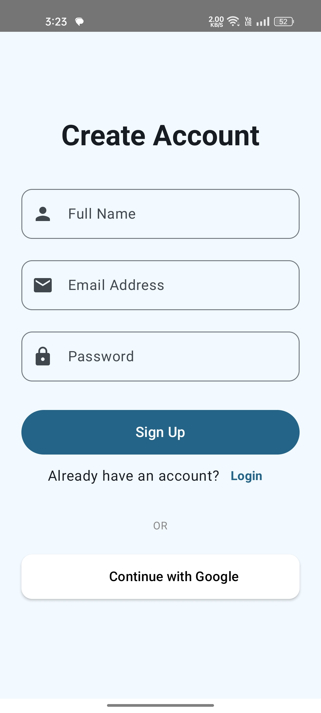
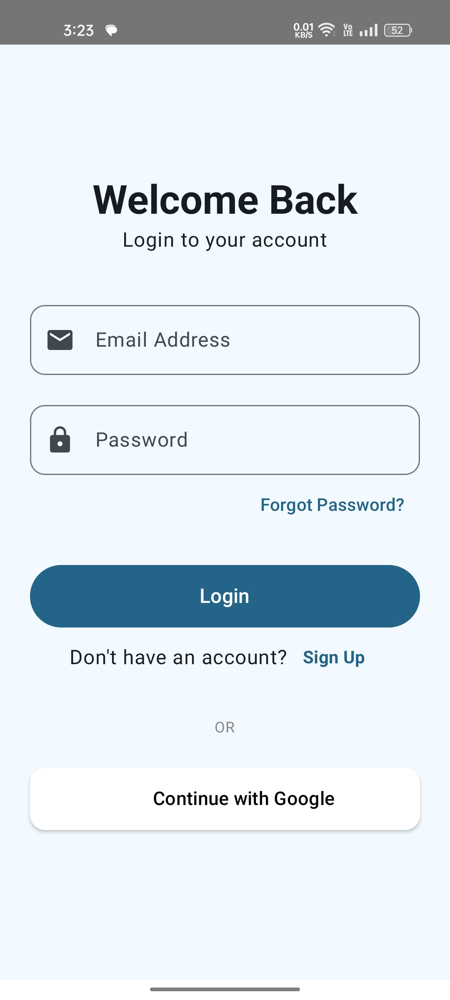
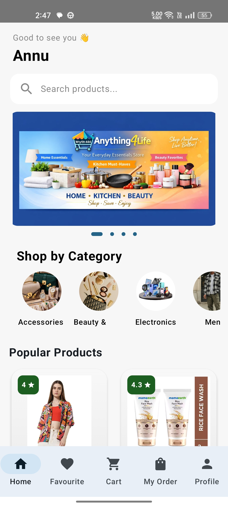
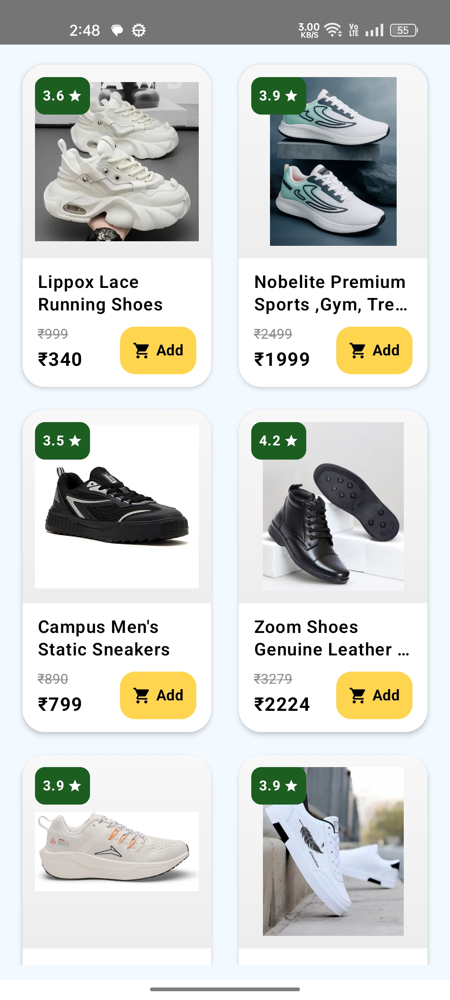
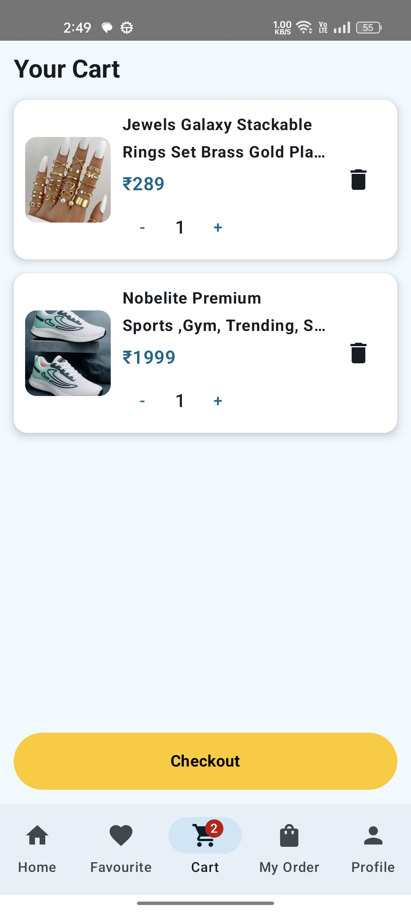
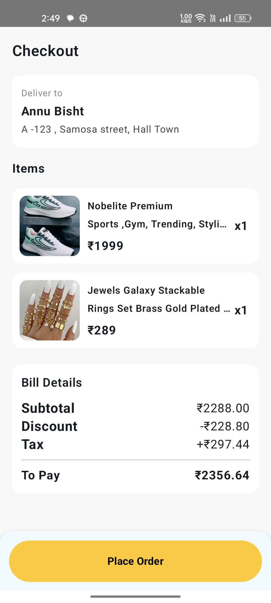
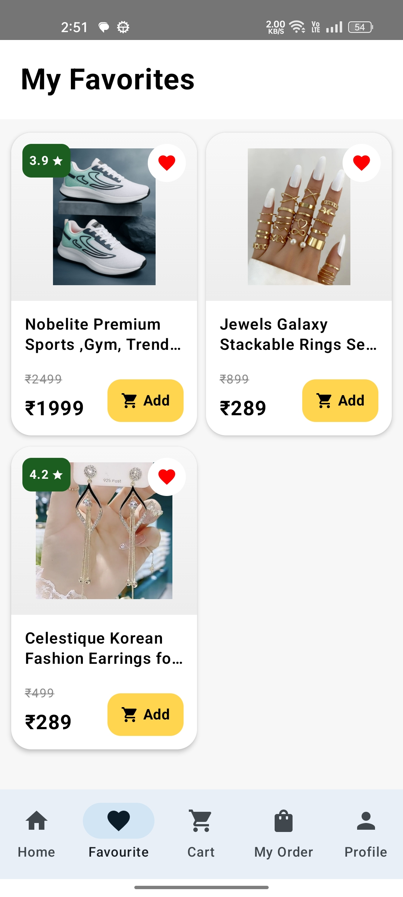
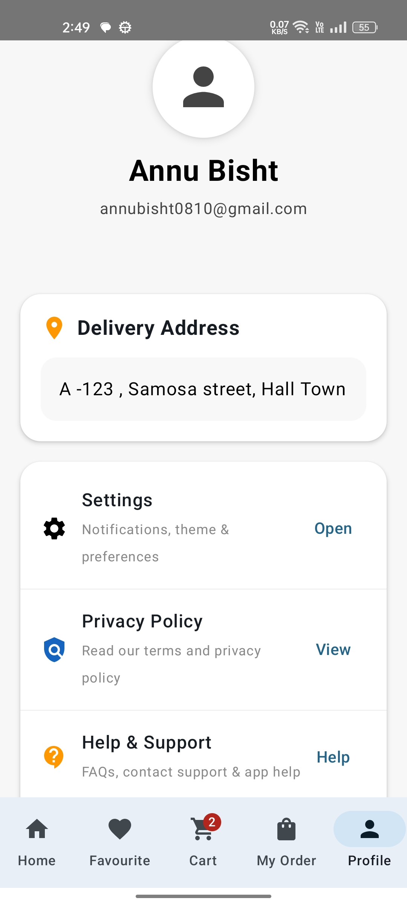
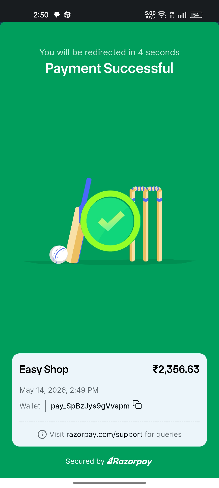

# 🛍️ Buyee

Buyee is a simple shopping app built using Kotlin and Jetpack Compose.  
This app shows products with a modern UI and smooth user experience.

---

# ✨ Features

- 🛒 Product Listing
- 📱 Modern UI with Jetpack Compose
- 🔍 Product Details Screen
- ❤️ Easy Navigation
- 🔥 Firebase Integration

---

# 🛠️ Tech Stack

- Kotlin
- Jetpack Compose
- Firebase Auth/firestore
- Material 3
- Navigation Component
- Coil (for image loading)
- MVVM Architecture
- Android Studio
- Gradle

---

# 📸 Screenshots

 
 
 
 
 
 


---

# 🚀 Getting Started

## 1️⃣ Clone the Repository

```bash
git clone https://github.com/Anisha956/Buyee.git
```

## 2️⃣ Open Project

Open the project in Android Studio.

---

## 3️⃣ Sync Gradle

Wait for Gradle sync to complete.

---

## 4️⃣ Run the App

Connect your Android device or start emulator and click ▶ Run.

---

# 🛠️ Built With

- Kotlin
- Jetpack Compose
- Android Studio
- Firebase

---

# 🔐 Important

`google-services.json` is not uploaded for security reasons.

---

# 👩‍💻 Developer

Made with ❤️ by Anisha

GitHub: https://github.com/Anisha956
